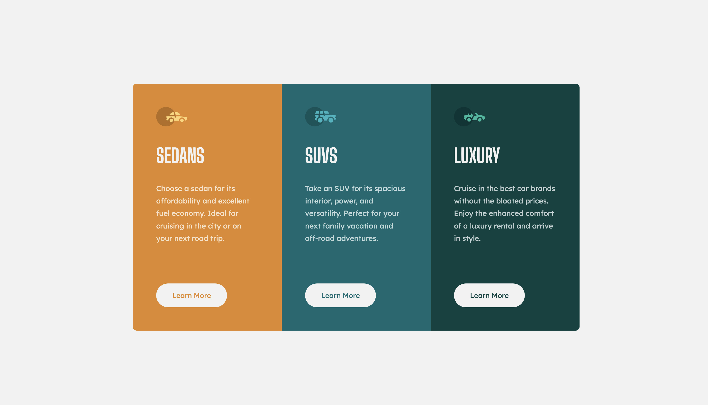

# Frontend Mentor - 3-column preview card component solution

This is a solution to the [3-column preview card component challenge on Frontend Mentor](https://www.frontendmentor.io/challenges/3column-preview-card-component-pH92eAR2-).

## Table of contents

- [Overview](#overview)
  - [Screenshot](#screenshot)
  - [Links](#links)
- [My process](#my-process)
  - [Built with](#built-with)
- [Author](#author)

## Overview

### Screenshots

#### Desktop View:

#### Mobile View:

### Links

- Solution URL: https://www.frontendmentor.io/solutions/responsive-design-using-html-and-css-ZQxhKvuBOd
- Live Site URL: https://perfectshuffle.github.io/frontendmentor.io-3-column-preview-card-component/

## My process

### Built with

- HTML
- CSS

## Author

- Github - [perfectshuffle](https://www.github.com/perfectshuffle)
- Frontend Mentor - [@perfectshuffle](https://www.frontendmentor.io/profile/perfectshuffle)
